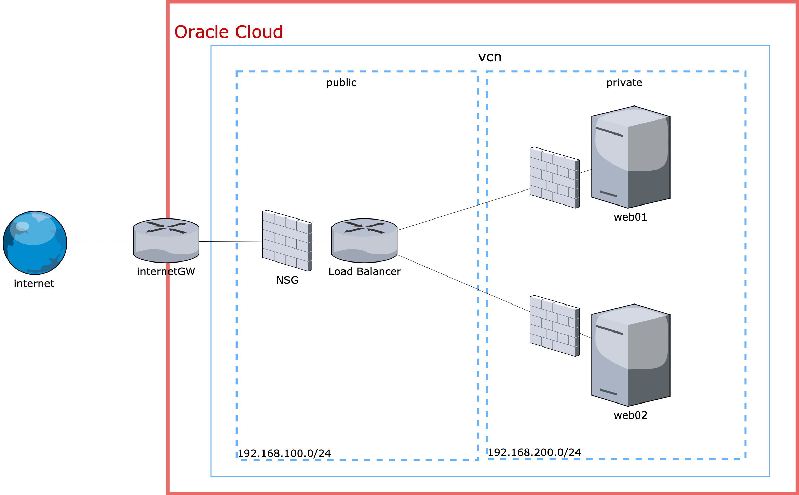

# Overview
create this resource on oci.


# QuickStart
```shell
$ git clone https://github.com/yuki9431/terraform-oci

$ cd terraform-oci/terraform_oci_minimal_web

$ vi oci_web/terraform.tfvars
```

write your oci parameters.
```
# general oci parameters
region           = "ap-tokyo-1"
compartment_id   = "ocid1.compartment.oc1.."
tenancy_ocid     = "ocid1.tenancy.oc1.."
user_ocid        = "ocid1.user.oc1.."
fingerprint      = "ff:ff:ff:ff:ff"
private_key_path = "~/private.pem"
```

last, apply terraform
```
$ terraform init
$ terraform apply
```

## Author
[Dillen H. Tomida](https://github.com/yuki9431)
